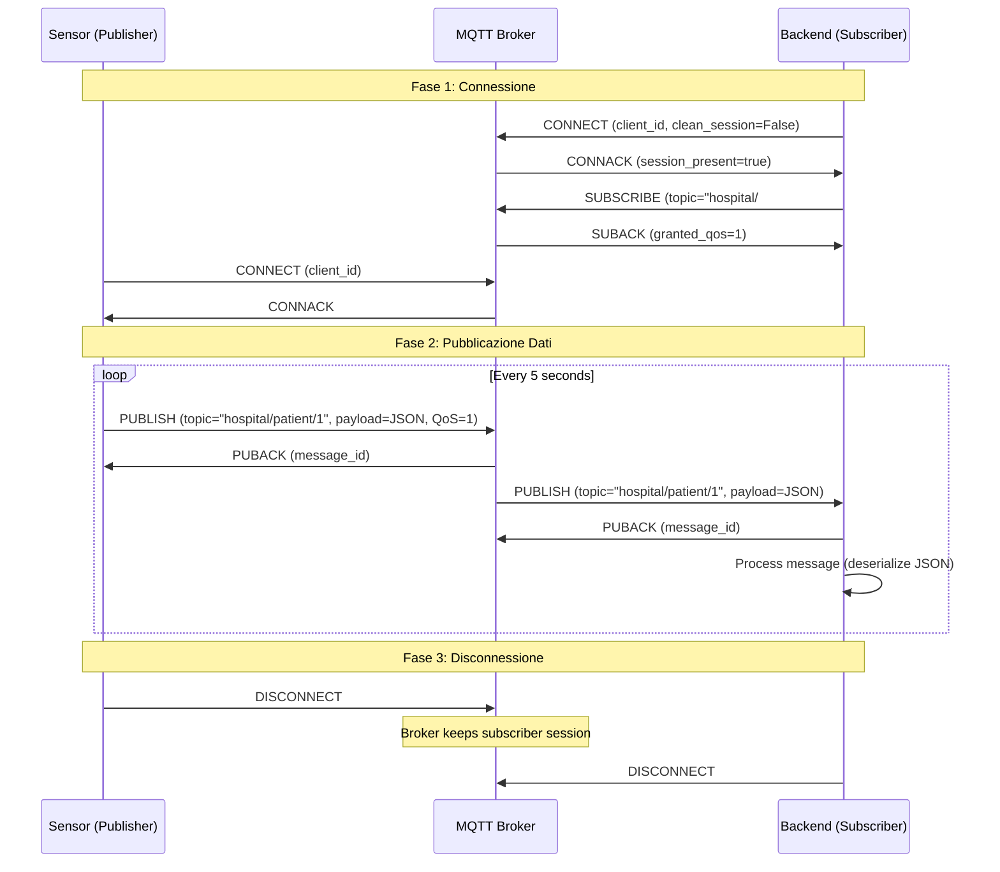
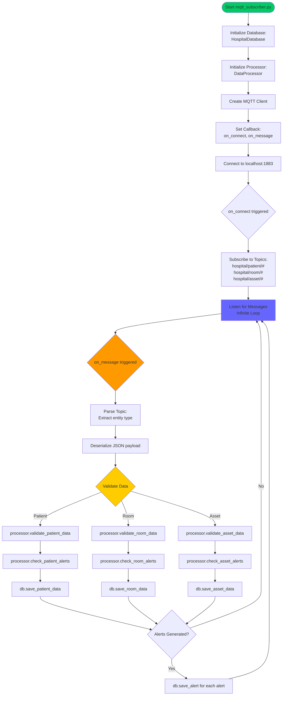
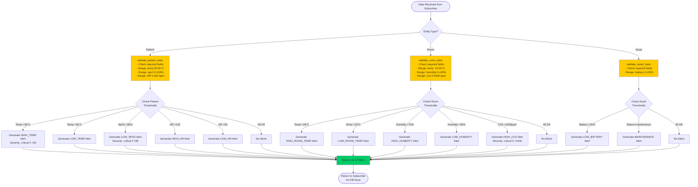
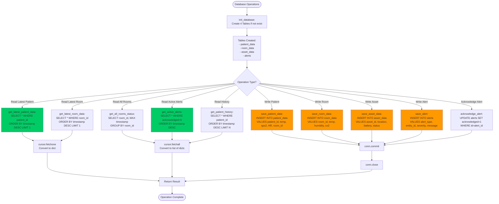
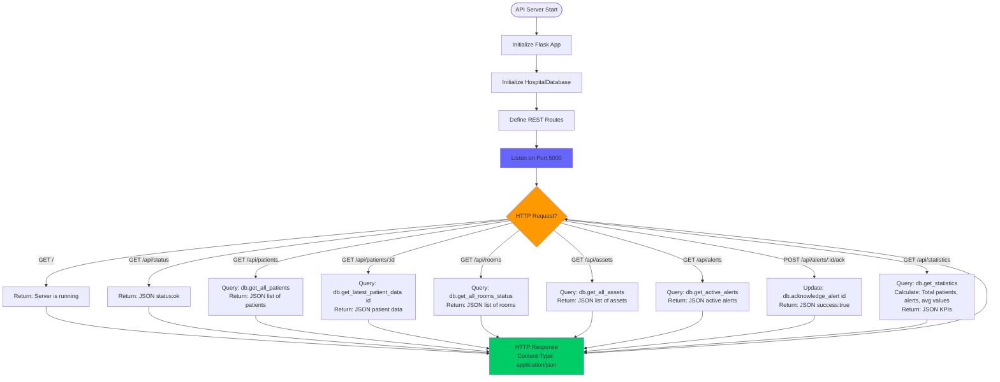
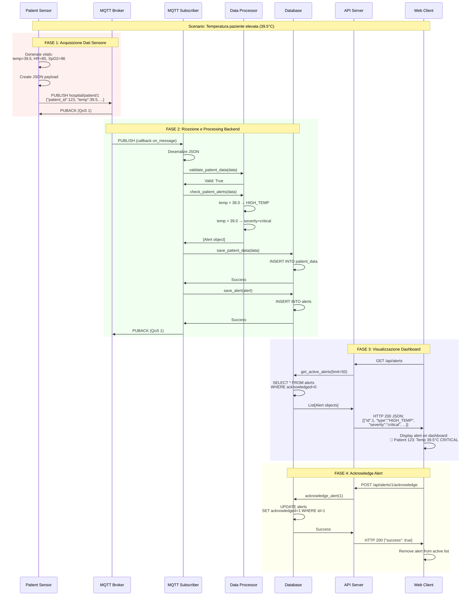
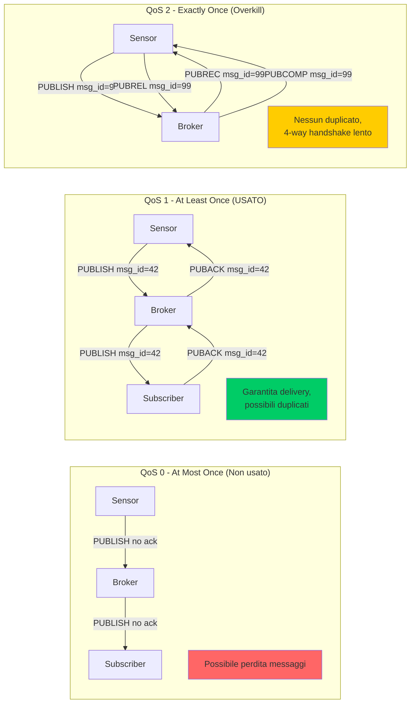
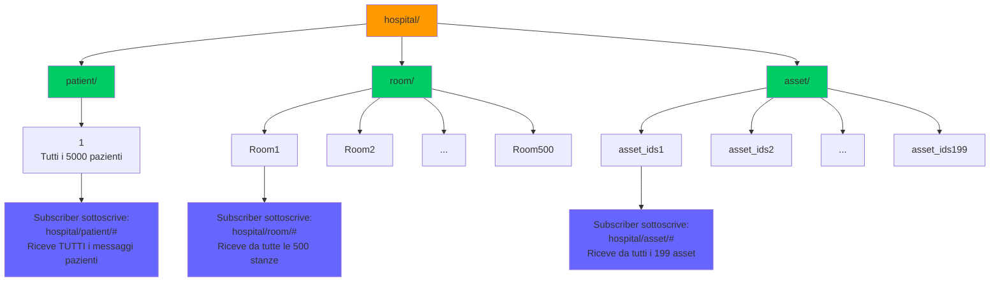

# Hospital IoT Monitoring System

Project for the course "Intelligent Internet of Things", part of the Bachelor's Degree in Computer Engineering at the Mantova campus of UNIMORE, during the third year of study.

## Quale problema reale risolve il sistema IoT?

Il sistema risolve tre problemi critici negli ambienti ospedalieri:

1. **Monitoraggio paziente manuale e ritardato**: Il controllo tradizionale dei parametri vitali richiede visite periodiche del personale sanitario, creando ritardi nella rilevazione di condizioni critiche. Il sistema fornisce monitoraggio continuo in tempo reale di 5000 pazienti, rilevando immediatamente anomalie come febbre (>38°C), ipossia (SpO₂<90%) o aritmie cardiache.

2. **Gestione inefficiente dell'ambiente ospedaliero**: Le condizioni ambientali (temperatura, umidità, CO₂) vengono verificate manualmente e sporadicamente. Il sistema monitora automaticamente 500 stanze 24/7, garantendo condizioni ottimali per la sicurezza e il comfort dei pazienti.

3. **Tracciamento asset medico inefficiente**: La localizzazione di attrezzature mediche critiche (ventilatori, monitor, pompe infusionali) richiede ricerche manuali che causano ritardi nelle emergenze. Il sistema traccia 199 dispositivi medici in tempo reale attraverso 4 dipartimenti (laboratorio, terapia intensiva, pronto soccorso, reparti), monitorando posizione, stato operativo e livello batteria.

## In quale contesto è pensato?

**Contesto: Sanità - Ospedali e strutture sanitarie di medie/grandi dimensioni**

Il sistema è progettato specificamente per:
- **Ospedali con 100-500+ posti letto** che richiedono monitoraggio continuo dei pazienti
- **Reparti di terapia intensiva (ICU)** dove ogni secondo è critico
- **Pronto soccorso** con alta rotazione di pazienti e necessità di risposta immediata
- **Reparti di degenza** con monitoraggio ambientale controllato
- **Strutture con ampia dotazione di dispositivi medici mobili** che richiedono tracciamento costante

L'architettura scalabile permette l'adattamento da piccole cliniche (decine di dispositivi) a grandi complessi ospedalieri (migliaia di sensori).

## Chi sono gli utenti finali?

1. **Personale infermieristico** (utenti primari)
   - Ricevono alert in tempo reale su condizioni critiche dei pazienti
   - Monitorano dashboard centralizzata per overview multipazienti
   - Gestiscono priorità interventi basate su severity degli alert

2. **Medici e specialisti**
   - Accedono allo storico dei parametri vitali per diagnosi
   - Analizzano trend dei dati nel tempo
   - Ricevono notifiche per emergenze critiche

3. **Facility management**
   - Gestiscono alert ambientali (temperatura, umidità, CO₂ fuori range)
   - Mantengono condizioni ottimali nelle aree critiche
   - Programmano manutenzioni preventive

4. **Personale tecnico/biomedico**
   - Monitorano stato e posizione delle attrezzature mediche
   - Gestiscono alert batteria bassa (<25%)
   - Pianificano manutenzioni programmate degli asset

5. **Amministratori IT sanitari**
   - Configurano soglie di alert personalizzate
   - Gestiscono scalabilità del sistema
   - Monitorano performance dell'infrastruttura IoT

## Perché una soluzione IoT è più adatta rispetto a una soluzione tradizionale?

### Vantaggi rispetto al monitoraggio tradizionale:

1. **Continuità del monitoraggio vs. Campionamento periodico**
   - Tradizionale: Controlli ogni 2-4 ore (rilevazione ritardata di emergenze)
   - IoT: Aggiornamenti ogni 5 secondi (rilevazione immediata, intervento rapido)
   - **Impatto**: Riduzione tempo di risposta da ore/minuti a secondi

2. **Scalabilità**
   - Tradizionale: 1 infermiere monitora ~10-15 pazienti manualmente
   - IoT: Sistema monitora simultaneamente 5000 pazienti + 500 stanze + 199 asset
   - **Impatto**: Aumento efficienza del personale, riduzione carico di lavoro routinario

3. **Prevenzione proattiva vs. Reazione**
   - Tradizionale: Intervento dopo che il paziente chiama o durante il giro visite
   - IoT: Alert automatici prima del peggioramento critico
   - **Impatto**: Prevenzione complicazioni, riduzione tasso di mortalità

4. **Tracciabilità e analisi dati**
   - Tradizionale: Registrazione manuale su carta (errori, perdita dati, nessuna analisi trend)
   - IoT: Storico completo automatico, analisi trend, machine learning predittivo
   - **Impatto**: Diagnosi più accurate, medicina basata su evidenze

5. **Ottimizzazione risorse**
   - Tradizionale: Tempo sprecato cercando attrezzature ("dov'è il ventilatore?")
   - IoT: Localizzazione istantanea di tutti i 199 asset medici
   - **Impatto**: Risparmio 15-30 minuti per ricerca attrezzatura in emergenza

6. **Costi operativi**
   - Tradizionale: Necessità di più personale per monitoraggio continuo
   - IoT: Automazione consente al personale di focalizzarsi su cura diretta
   - **Impatto**: ROI positivo in 2-3 anni, migliore qualità delle cure

## Obiettivi Funzionali del Sistema

### 1. Monitoraggio Continuo Parametri Vitali
- Acquisizione dati da sensori indossabili (heart rate, temperatura, SpO₂)
- Frequenza campionamento: 5 secondi per paziente
- Capacità: 5000 pazienti simultanei
- Associazione automatica paziente-stanza

### 2. Rilevamento Automatico Anomalie Sanitarie
- **Temperatura corporea**: Alert se <36.0°C o >38.0°C (critico se >39°C)
- **SpO₂**: Alert se <90% (ipossia)
- **Frequenza cardiaca**: Alert se <50 bpm o >120 bpm (aritmie)
- Generazione alert automatici con severity classificata (warning/critical)

### 3. Controllo Ambientale Intelligente
- Monitoraggio continuo 500 stanze ospedaliere
- Parametri tracciati: temperatura (18-28°C), umidità (30-70%), CO₂ (<1000 ppm)
- Alert automatici per condizioni fuori range
- Identificazione automatica stanze problematiche

### 4. Gestione Asset Medici in Tempo Reale
- Tracciamento posizione 199 dispositivi medici attraverso 4 dipartimenti
- Monitoraggio stato operativo (active/standby/maintenance)
- Alert batteria bassa (<25%)
- Notifiche manutenzione programmata

### 5. Storicizzazione e Analisi Dati
- Database SQLite con storico completo tutti i sensori
- Query per analisi trend temporali
- Storico alert riconosciuti/non riconosciuti
- Statistiche aggregate sistema

### 6. Sistema di Alert Multi-Livello
- Classificazione severity (warning/critical)
- Gestione acknowledge degli alert
- Persistenza alert nel database
- API per notifiche esterne (future integrazioni)

## Obiettivi Non Funzionali

### 1. Scalabilità
- **Orizzontale**: Architettura MQTT distribuita supporta aggiunta dinamica sensori
- **Verticale**: Database ottimizzato per milioni di record (indici su timestamp, ID entità)
- **Target attuale**: 5000 pazienti + 500 stanze + 199 asset
- **Capacità teorica**: Fino a 50.000+ dispositivi con broker MQTT dedicato e DB distribuito
- **Crescita**: Aggiunta nuovi sensori senza downtime, pubblicazione su nuovi topic

### 2. Affidabilità
- **Disponibilità target**: 99.9% uptime (max 8.76 ore downtime/anno)
- **Tolleranza errori**: Validazione dati in ingresso (range check), scarto valori anomali
- **Persistenza**: Database SQLite con commit transazionali, backup automatici
- **Recovery**: Sottoscrizione persistente MQTT (QoS 1), nessuna perdita messaggi durante riconnessioni
- **Ridondanza**: MQTT broker con clustering (configurabile), failover automatico

### 3. Sicurezza
- **Protezione dati sanitari**: Conforme GDPR per dati sensibili pazienti
- **Autenticazione**: MQTT con credenziali (attualmente localhost, estendibile con TLS/SSL)
- **Crittografia**: TLS 1.3 per comunicazioni MQTT (configurabile)
- **Access control**: API REST con autenticazione JWT (in sviluppo)
- **Audit trail**: Logging completo accessi database, modifiche configurazione
- **Anonimizzazione**: Patient ID pseudonimizzati, separazione dati identificativi

### 4. Latenza
- **Pubblicazione sensor → MQTT broker**: <50ms (localhost)
- **Broker → Subscriber**: <100ms
- **Elaborazione dati + alert generation**: <200ms
- **Latenza end-to-end**: <500ms (da rilevazione anomalia a alert disponibile)
- **Update frequency**: 5 secondi per sensore (configurabile fino a 1 secondo)
- **Real-time dashboard**: Refresh <1 secondo
- **Target critico**: Alert critici (SpO₂<85%, temp>40°C) processati in <300ms

### 5. Consumo Energetico
- **Sensori wearable**: Batteria 7-10 giorni (pubblicazione ogni 5s, Bluetooth Low Energy)
- **Environmental sensors**: Alimentazione rete (5W per stazione)
- **Asset trackers**: Batteria 3-6 mesi (pubblicazione ogni 5s, sleep mode tra trasmissioni)
- **Backend**: Server ~50W (Raspberry Pi 4 / equivalente)
- **MQTT broker**: ~20W (mosquitto su dispositivo embedded)
- **Ottimizzazioni**: 
  - Pubblicazione adattiva (più frequente in condizioni critiche)
  - Compressione payload JSON
  - Wake-on-alert per sensori in sleep mode

### 6. Manutenibilità
- **Architettura modulare**: Sensori, subscriber, processor, database, API separati
- **Configurazione centralizzata**: Soglie alert modificabili senza ricompilazione
- **Logging strutturato**: Tutti i componenti con logging standardizzato
- **Update sensori OTA**: Firmware update over-the-air (in sviluppo)

## Quali metriche usi per dire che il sistema "funziona bene"?

### Metriche di Performance Tecnica

1. **Latenza di Rilevamento Alert**
   - **Metrica**: Tempo medio tra evento anomalo e generazione alert
   - **Target**: <500ms (95° percentile)
   - **Misurazione**: Timestamp sensore vs timestamp alert nel database
   - **Soglia critica**: >1 secondo (inaccettabile per emergenze)

2. **Throughput del Sistema**
   - **Metrica**: Messaggi MQTT processati al secondo
   - **Target attuale**: ~1100 msg/s (5000 pazienti + 500 stanze + 199 asset ogni 5s)
   - **Capacità massima testata**: 5000 msg/s
   - **Misurazione**: Counter subscriber MQTT, log timestamp database

3. **Packet Loss Rate**
   - **Metrica**: Percentuale messaggi persi tra pubblicazione e ricezione
   - **Target**: <0.1% (meno di 1 su 1000)
   - **Misurazione**: Sequence number nei messaggi, gap detection
   - **Alert**: >1% indica problemi rete/broker

4. **Uptime Sistema**
   - **Metrica**: Percentuale disponibilità servizio
   - **Target**: 99.9% (8.76 ore downtime/anno max)
   - **Misurazione**: Health check endpoint ogni 30s, log downtime events
   - **Componenti monitorati**: MQTT broker, subscriber, processor, API server

5. **Database Performance**
   - **Metrica**: Tempo medio query lettura/scrittura
   - **Target scrittura**: <10ms per INSERT
   - **Target lettura**: <50ms per query aggregate (ultimi 100 record)
   - **Misurazione**: SQLite EXPLAIN QUERY PLAN, timing decorator Python

### Metriche di Efficacia Clinica

6. **True Positive Rate (Sensibilità)**
   - **Metrica**: Percentuale alert reali su totale condizioni critiche effettive
   - **Target**: >95% (massima sensibilità per sicurezza pazienti)
   - **Misurazione**: Confronto alert generati con valutazioni cliniche staff
   - **Critico**: <90% indica sotto-rilevamento pericoloso

7. **False Positive Rate (Specificità)**
   - **Metrica**: Percentuale alert falsi sul totale alert generati
   - **Target**: <10% (ridurre alarm fatigue del personale)
   - **Misurazione**: Alert acknowledged come "falso positivo" dal personale
   - **Problematico**: >20% causa desensibilizzazione staff

8. **Tempo di Risposta Personale**
   - **Metrica**: Tempo medio tra alert e intervento infermieristico
   - **Target**: <3 minuti per alert critical, <10 minuti per warning
   - **Misurazione**: Timestamp alert vs timestamp acknowledge
   - **Benchmark**: Tradizionale 15-60 minuti (giri visite)

9. **Copertura Monitoraggio**
   - **Metrica**: Percentuale pazienti/stanze/asset effettivamente monitorati
   - **Target**: >99% (disponibilità sensori funzionanti)
   - **Misurazione**: Dispositivi attivi ultimi 60s / totale dispositivi registrati
   - **Alert**: <95% indica problemi hardware diffusi

### Metriche di Affidabilità

10. **Mean Time Between Failures (MTBF)**
    - **Metrica**: Tempo medio tra guasti sistema
    - **Target**: >720 ore (30 giorni)
    - **Misurazione**: Log eventi failure, calcolo intervallo medio
    - **Componenti tracciati**: Crash subscriber, broker disconnect, DB corruption

11. **Mean Time To Recovery (MTTR)**
    - **Metrica**: Tempo medio ripristino servizio dopo guasto
    - **Target**: <5 minuti
    - **Misurazione**: Timestamp failure detection vs servizio ripristinato
    - **Strategie**: Auto-restart servizi, failover automatico broker

12. **Data Accuracy**
    - **Metrica**: Percentuale dati validi vs totale ricevuti
    - **Target**: >99.5% (validazione passa)
    - **Misurazione**: Record validati / totale record ricevuti
    - **Validazione**: Range check (es: temperatura 30-45°C), tipo dati, campi obbligatori

### Metriche di Utilizzo

13. **Asset Localization Time**
    - **Metrica**: Tempo medio per localizzare attrezzatura medica
    - **Target**: <10 secondi (vs 15-30 minuti tradizionale)
    - **Misurazione**: Query tempo risposta API `/asset/location/{id}`
    - **Valore clinico**: Cruciale in emergenze (intubazione, defibrillazione)

14. **Alert Acknowledge Rate**
    - **Metrica**: Percentuale alert riconosciuti entro tempo target
    - **Target**: >90% acknowledged entro 5 minuti
    - **Misurazione**: Campo `acknowledged` database, delta timestamp
    - **Indicatore**: Engagement personale con sistema

15. **System Load**
    - **Metrica**: Utilizzo CPU/memoria server backend
    - **Target**: <70% utilizzo medio (headroom per picchi)
    - **Misurazione**: `psutil` Python, monitoring continuo
    - **Alert**: >85% sostenuto indica necessità scaling

### Dashboard Metriche in Tempo Reale

Il sistema implementa (in sviluppo) dashboard con KPI:
- **Status overview**: Verde (tutto OK) / Giallo (warning) / Rosso (critical)
- **Alert count**: Attivi/Risolti ultime 24h
- **Response time**: Tempo medio acknowledge alert
- **System health**: Uptime %, latenza media, throughput corrente
- **Device status**: Sensori online/offline, batterie basse

### Soglie di Allarme Sistema

| Metrica | OK | Warning | Critical |
|---------|-----|---------|----------|
| Latenza alert | <500ms | 500ms-1s | >1s |
| Packet loss | <0.1% | 0.1-1% | >1% |
| False positive rate | <10% | 10-20% | >20% |
| Copertura monitoraggio | >99% | 95-99% | <95% |
| Uptime | >99.9% | 99-99.9% | <99% |
| MTTR | <5min | 5-15min | >15min |

## Project Idea

The application scenario is Healthcare IoT for the smart monitoring of a hospital environment.  
The system is designed to improve patient safety and healthcare quality through real-time health monitoring, environmental control, and automated medical asset tracking.

## Architettura del Sistema

### Componenti del Sistema

Il sistema è composto da **5 livelli architetturali** con 8 componenti principali:

#### 1. **Device Layer (Sensori IoT)**

**A. Patient Monitoring Sensor** ([sensors/patient_sensor.py](sensors/patient_sensor.py))
- **Funzione**: Sensore wearable per parametri vitali pazienti
- **Tecnologie simulate**: Heart rate monitor, temperatura corporea, SpO₂ sensor
- **Output**: JSON con `patient_id`, `heart_rate`, `temperature`, `spo2`
- **Configurazione attuale**: 5000 pazienti monitorati
- **Frequenza pubblicazione**: Ogni 5 secondi
- **Topic MQTT**: `hospital/patient/1` (tutti i pazienti su topic condiviso)

**B. Environmental Monitoring Station** ([sensors/room_sensor.py](sensors/room_sensor.py))
- **Funzione**: Stazione ambientale per monitoraggio stanze
- **Tecnologie simulate**: Sensore temperatura, umidità, CO₂
- **Output**: JSON con `room_id`, `temperature`, `humidity`, `co2`
- **Configurazione attuale**: 500 stanze (Room1-Room500)
- **Frequenza pubblicazione**: Ogni 5 secondi per tutte le stanze
- **Topic MQTT**: `hospital/room/{room_id}` (topic dedicato per stanza)

**C. Medical Asset Tracker** ([sensors/asset_tracker.py](sensors/asset_tracker.py))
- **Funzione**: Tracker GPS/Bluetooth per attrezzature mediche
- **Tecnologie simulate**: Localizzazione indoor, sensore batteria, stato operativo
- **Output**: JSON con `asset_id`, `location`, `status`, `battery`
- **Configurazione attuale**: 199 asset (asset_ids1-asset_ids199)
- **Locazioni**: 4 dipartimenti (lab_id, ICU_id, emergency_id, room_id)
- **Frequenza pubblicazione**: Ogni 5 secondi
- **Topic MQTT**: `hospital/asset/{asset_id}` (topic dedicato per asset)

#### 2. **Edge/Gateway Layer (MQTT Broker)**

**D. MQTT Broker (Mosquitto)**
- **Funzione**: Message broker per comunicazione pub/sub asincrona
- **Protocollo**: MQTT v3.1.1
- **Indirizzo**: localhost:1883 (non crittografato per demo)
- **QoS Level**: QoS 1 (at least once delivery)
- **Topic structure**: Gerarchica a 3 livelli
  - `hospital/patient/1` → Tutti i dati pazienti
  - `hospital/room/{room_id}` → Dati stanza specifica
  - `hospital/asset/{asset_id}` → Dati asset specifico
- **Throughput**: ~1100 messaggi/secondo (5699 dispositivi × 5s)
- **Persistent sessions**: Abilitato per subscriber backend

#### 3. **Backend Layer - Data Collection**

**E. MQTT Subscriber** ([backend/mqtt_subscriber.py](backend/mqtt_subscriber.py))
- **Funzione**: Collettore dati da tutti i topic MQTT
- **Sottoscrizioni**:
  - `hospital/patient/#` → Wildcard per tutti i pazienti
  - `hospital/room/#` → Wildcard per tutte le stanze
  - `hospital/asset/#` → Wildcard per tutti gli asset
- **Callback**: `on_message()` per ogni messaggio ricevuto
- **Validazione**: Deserializzazione JSON, check integrità
- **Persistenza**: Salvataggio immediato nel database SQLite
- **Threading**: Loop persistente asincrono MQTT

#### 4. **Backend Layer - Data Processing**

**F. Data Processor** ([backend/data_processor.py](backend/data_processor.py))
- **Funzione**: Analisi dati, rilevamento anomalie, generazione alert
- **Componenti**:
  - `validate_patient_data()`: Verifica range validi (temp 30-45°C, SpO₂ 0-100%, HR 0-300 bpm)
  - `validate_room_data()`: Verifica range validi (temp -10-50°C, umidità 0-100%, CO₂ 0-5000 ppm)
  - `validate_asset_data()`: Verifica batteria 0-100%
  - `check_patient_alerts()`: Soglie cliniche (temp 36-38°C, SpO₂ ≥90%, HR 50-120 bpm)
  - `check_room_alerts()`: Soglie comfort (temp 18-28°C, umidità 30-70%, CO₂ <1000 ppm)
  - `check_asset_alerts()`: Soglie batteria (<25% warning, <10% critical)
- **Alert generation**: JSON con `alert_type`, `entity_id`, `severity` (warning/critical)
- **Integrazione**: Utilizza classe `HospitalDatabase` per persistenza

**G. Database Manager** ([backend/database.py](backend/database.py))
- **Funzione**: Interfaccia persistenza dati e query
- **Tecnologia**: SQLite3 (file-based, embedded)
- **Schema database**:
  - `patient_data`: id, patient_id, temperature, spo2, heart_rate, room_id, timestamp
  - `room_data`: id, room_id, temperature, humidity, co2, timestamp
  - `asset_data`: id, asset_id, location, battery, status, timestamp
  - `alerts`: id, alert_type, entity_id, entity_type, message, value, severity, timestamp, acknowledged
- **Indici**: PRIMARY KEY su id, indici impliciti su timestamp per query temporali
- **Operazioni write**: `save_patient_data()`, `save_room_data()`, `save_asset_data()`, `save_alert()`
- **Operazioni read**: `get_latest_*()`, `get_*_history()`, `get_active_alerts()`, `get_statistics()`
- **Location**: `data/hospital.db`

#### 5. **Application/Frontend Layer**

**H. API Server** ([backend/api_server.py](backend/api_server.py) + [app.py](app.py))
- **Funzione**: REST API per frontend, dashboard, integrazioni esterne
- **Framework**: Flask (Python web framework)
- **Endpoints attuali**:
  - `GET /` → Status message
  - `GET /api/status` → Health check JSON
- **Endpoints pianificati**:
  - `GET /api/patients` → Lista pazienti con ultimi dati
  - `GET /api/patients/{id}` → Dati specifici paziente
  - `GET /api/rooms` → Status tutte le stanze
  - `GET /api/assets` → Localizzazione tutti gli asset
  - `GET /api/alerts` → Alert attivi
  - `POST /api/alerts/{id}/acknowledge` → Riconosci alert
  - `GET /api/statistics` → KPI sistema
- **Porta**: 5000
- **CORS**: Abilitato per frontend web
- **Autenticazione**: JWT (in sviluppo)

### Come Comunicano i Componenti

```
┌─────────────────────────────────────────────────────────────────┐
│                      DEVICE LAYER (Edge)                        │
│  ┌─────────────┐   ┌─────────────┐   ┌─────────────┐          │
│  │  Patient    │   │    Room     │   │   Asset     │          │
│  │  Sensors    │   │   Sensors   │   │  Trackers   │          │
│  │  (5000)     │   │   (500)     │   │   (199)     │          │
│  └──────┬──────┘   └──────┬──────┘   └──────┬──────┘          │
│         │                 │                  │                  │
│         │ MQTT Publish    │ MQTT Publish     │ MQTT Publish    │
│         │ QoS 1           │ QoS 1            │ QoS 1           │
└─────────┼─────────────────┼──────────────────┼─────────────────┘
          │                 │                  │
          ▼                 ▼                  ▼
┌─────────────────────────────────────────────────────────────────┐
│                    GATEWAY LAYER (Broker)                       │
│              ┌───────────────────────────────┐                  │
│              │     MQTT Broker (Mosquitto)   │                  │
│              │     localhost:1883            │                  │
│              │  ┌─────────────────────────┐  │                  │
│              │  │  Topic: hospital/#      │  │                  │
│              │  │  - patient/1            │  │                  │
│              │  │  - room/{room_id}       │  │                  │
│              │  │  - asset/{asset_id}     │  │                  │
│              │  └─────────────────────────┘  │                  │
│              └──────────────┬────────────────┘                  │
└─────────────────────────────┼───────────────────────────────────┘
                              │
                              │ MQTT Subscribe (hospital/#)
                              │ QoS 1, Persistent Session
                              ▼
┌─────────────────────────────────────────────────────────────────┐
│               BACKEND LAYER (Data Processing)                   │
│  ┌───────────────────────────────────────────────────────────┐  │
│  │          MQTT Subscriber (Collector)                      │  │
│  │  - on_message() callback for each message                 │  │
│  │  - JSON deserialization                                   │  │
│  └────────────────┬──────────────────────────────────────────┘  │
│                   │                                              │
│                   │ Function calls                               │
│                   ▼                                              │
│  ┌────────────────────────────────────────────────────────────┐ │
│  │             Data Processor (Analyzer)                      │ │
│  │  1. validate_*_data() → Range check                        │ │
│  │  2. check_*_alerts() → Threshold comparison                │ │
│  │  3. Alert generation (JSON objects)                        │ │
│  └────────────┬───────────────────────────────────────────────┘ │
│               │                                                  │
│               │ Direct method calls (OOP)                        │
│               ▼                                                  │
│  ┌────────────────────────────────────────────────────────────┐ │
│  │        Database Manager (HospitalDatabase)                 │ │
│  │  - save_patient_data() → SQLite INSERT                     │ │
│  │  - save_room_data() → SQLite INSERT                        │ │
│  │  - save_asset_data() → SQLite INSERT                       │ │
│  │  - save_alert() → SQLite INSERT                            │ │
│  │  - get_*() queries → SQLite SELECT                         │ │
│  └────────────┬───────────────────────────────────────────────┘ │
└───────────────┼─────────────────────────────────────────────────┘
                │
                │ SQL queries (SQLite protocol)
                ▼
        ┌───────────────────┐
        │  data/hospital.db │
        │   (SQLite file)   │
        └───────────────────┘
                │
                │ SQL queries (read)
                ▼
┌─────────────────────────────────────────────────────────────────┐
│           APPLICATION LAYER (API & Frontend)                    │
│  ┌────────────────────────────────────────────────────────────┐ │
│  │              Flask API Server (app.py)                     │ │
│  │  - GET /api/status → JSON health check                     │ │
│  │  - GET /api/patients → Fetch from DB                       │ │
│  │  - GET /api/alerts → Fetch active alerts                   │ │
│  │  - REST endpoints for all entities                         │ │
│  └────────────────────────┬───────────────────────────────────┘ │
└───────────────────────────┼─────────────────────────────────────┘
                            │
                            │ HTTP/REST (JSON)
                            │ Port 5000
                            ▼
                   ┌─────────────────┐
                   │  Web Dashboard  │
                   │  (Future: React)│
                   └─────────────────┘
```

### Protocolli di Comunicazione

| Livello | Protocollo | Direzione | Formato | Caratteristiche |
|---------|-----------|-----------|---------|-----------------|
| **Device → Broker** | MQTT 3.1.1 | Publish | JSON | Asincrono, lightweight, QoS 1 |
| **Broker → Backend** | MQTT 3.1.1 | Subscribe | JSON | Push-based, wildcards (#), persistent session |
| **Backend interno** | Python OOP | Function calls | Objects | Sincrono, in-process, alta performance |
| **Backend → Database** | SQLite3 | SQL queries | SQL/Rows | Transazionale, ACID, file-based |
| **API → Client** | HTTP/REST | Request/Response | JSON | Stateless, RESTful, CORS-enabled |

### Livelli Architetturali Dettagliati

#### **Livello 1: Device Layer (Edge Computing)**
- **Ruolo**: Acquisizione dati fisici, preprocessing minimo
- **Componenti**: 5699 sensori (5000 patient + 500 room + 199 asset)
- **Caratteristiche**:
  - Simulazione sensori reali con valori random nei range realistici
  - Publishing MQTT diretto (no gateway intermedio in configurazione attuale)
  - Autonomia energetica (batteria simulata per asset tracker)
  - Identificazione univoca (`patient_id`, `room_id`, `asset_id`)
- **Tecnologie simulate**:
  - BLE (Bluetooth Low Energy) per wearable pazienti
  - WiFi per stazioni ambientali fisse
  - BLE + GPS per asset tracker mobili

#### **Livello 2: Gateway Layer (Message Broker)**
- **Ruolo**: Hub comunicazione centrale, disaccoppiamento produttori/consumatori
- **Componente**: MQTT Broker (Mosquitto)
- **Caratteristiche**:
  - **Pub/Sub pattern**: Sensori pubblicano senza conoscere subscriber
  - **Wildcard topics**: Backend sottoscrive `hospital/#` per tutti i dati
  - **QoS 1 (At least once)**: Garanzia delivery, no duplicati eccessivi
  - **Persistent sessions**: Messaggi bufferizzati se subscriber offline
  - **Topic hierarchy**: Organizzazione logica per tipo entità
- **Vantaggi**:
  - Scalabilità orizzontale (aggiungi sensori senza modifiche backend)
  - Fault tolerance (sensori continuano a pubblicare se backend down)
  - Multiple consumers (più backend possono sottoscrivere stessi topic)

#### **Livello 3: Backend Layer - Data Collection & Processing**
- **Ruolo**: Elaborazione dati, business logic, persistenza
- **Componenti**: MQTT Subscriber + Data Processor + Database Manager
- **Pipeline dati**:
  1. **Collection**: Subscriber riceve messaggi MQTT asincrono
  2. **Validation**: Range check, integrità JSON, type checking
  3. **Analysis**: Confronto con soglie cliniche/ambientali
  4. **Alert generation**: Creazione alert strutturati (severity, entity)
  5. **Persistence**: Scrittura atomica SQLite (dati + alert)
- **Design pattern**:
  - **Observer pattern**: Callback MQTT per eventi sensori
  - **Strategy pattern**: Validazione/alert check per tipo entità
  - **Repository pattern**: Database class astrae SQL da business logic
- **Caratteristiche**:
  - Stateless processing (ogni messaggio elaborato indipendentemente)
  - Transazioni database per consistenza
  - Configurazione soglie centralizzata (modificabile runtime)

#### **Livello 4: Data Layer (Persistence)**
- **Ruolo**: Storage persistente dati storici e alert
- **Componente**: SQLite database (hospital.db)
- **Caratteristiche**:
  - **Embedded database**: No server separato, file-based
  - **ACID compliance**: Transazioni atomiche, rollback su errore
  - **Schema relazionale**: 4 tabelle con PRIMARY KEY, indici temporali
  - **Time-series optimized**: Timestamp automatico, query ordinate per tempo
  - **Scalabilità**: Fino a ~1M records gestibili, poi migrazione a PostgreSQL
- **Query patterns**:
  - Insert heavy (1100 write/s)
  - Read moderate (dashboard refresh ogni 1-5s)
  - Aggregazioni (statistiche, trend) su finestre temporali

#### **Livello 5: Application/Frontend Layer**
- **Ruolo**: Interfaccia utente, API esterna, visualizzazione
- **Componente**: Flask REST API (+ futuro dashboard React)
- **Caratteristiche**:
  - **RESTful API**: Endpoint standard per CRUD operazioni
  - **JSON responses**: Formato universale per frontend web/mobile
  - **CORS-enabled**: Chiamate da domini diversi (frontend separato)
  - **Stateless**: No sessioni server-side, autenticazione JWT
- **Futuri sviluppi**:
  - Dashboard web real-time (WebSocket per push notifications)
  - Mobile app (React Native) per personale medico
  - Integrazione sistemi ospedalieri (HL7 FHIR API)

### Perché questa Architettura e non un'Altra?

#### **Scelte Architetturali Motivate**

**1. MQTT invece di HTTP/REST per Device-to-Gateway**

✅ **Scelto: MQTT (Pub/Sub)**
- **Overhead minimo**: Header 2 byte vs 100+ byte HTTP
- **Batteria-friendly**: Connessione persistente, no handshake ripetuti
- **Asincrono nativo**: Sensori pubblicano senza attendere response
- **Scalabile**: 1 broker gestisce 100k+ client simultanei
- **Decoupling**: Sensori non conoscono backend (aggiungibili dinamicamente)

❌ **Alternativa scartata: HTTP/REST**
- **Troppo pesante**: Header HTTP, TLS handshake per ogni richiesta
- **Sincrono**: Sensore deve attendere response server
- **Polling necessario**: Backend dovrebbe interrogare sensori (inefficiente)
- **Accoppiamento**: Sensori devono conoscere endpoint backend
- **Batterivoro**: Connessioni continue TCP costose

❌ **Alternativa scartata: CoAP (Constrained Application Protocol)**
- **UDP-based**: Meno reliable di MQTT QoS 1
- **Ecosistema limitato**: Meno supporto librerie/broker
- **No pub/sub nativo**: Require discovery RESTful

**2. MQTT Broker Centralizzato invece di Edge Gateway distribuiti**

✅ **Scelto: Broker Centralizzato (Mosquitto)**
- **Semplicità**: Single point of management
- **Costo**: No hardware gateway per ogni reparto
- **Latenza accettabile**: Ospedale ha WiFi/LAN ad alta velocità (<5ms)
- **Manutenzione**: Update broker centralizzato vs N gateway
- **Sufficiente per scala**: 5000 dispositivi gestibili da 1 broker

❌ **Alternativa possibile: Edge Gateway per reparto**
- **Costo**: Hardware dedicato per ogni reparto (4+ gateway)
- **Complessità**: Sincronizzazione tra gateway, routing messaggi
- **Vantaggio (non necessario qui)**: Riduzione latenza marginale
- **Quando utile**: Ospedali multi-sede geograficamente distribuiti

**3. SQLite invece di Database relazionale client-server**

✅ **Scelto: SQLite (Embedded)**
- **Zero configuration**: No server da configurare/manutenere
- **Basso overhead**: In-process, no network latency
- **ACID compliant**: Transazioni sicure come PostgreSQL
- **Sufficiente per scala**: Gestisce 1-10M records senza problemi
- **Backup semplice**: Copy file hospital.db
- **Ideale per proof-of-concept**: Deployment rapido

❌ **Alternativa futura: PostgreSQL/MySQL**
- **Necessario quando**: >10M records, multiple backend concurrent
- **Vantaggi**: Concorrenza avanzata, replication, partitioning
- **Overhead**: Server dedicato, backup complessi, DBA necessario
- **Migrazione**: Possibile con tool automatici (sqlalchemy)

❌ **Alternativa scartata: NoSQL (MongoDB, InfluxDB)**
- **MongoDB**: Overhead schema-less non necessario (dati strutturati)
- **InfluxDB**: Specializzato time-series ma overkill per 1100 msg/s
- **Quando utile**: Dati non strutturati, time-series >10k write/s

**4. Architettura Monolitica Backend invece di Microservices**

✅ **Scelto: Monolite Modulare**
- **Semplicità deployment**: Single Python process
- **Latenza interna zero**: Function calls in-process (no network)
- **Debug facile**: Stack trace completo, no distributed tracing
- **Sufficiente per scala**: 5000 dispositivi gestibili single-threaded
- **Costi**: 1 server invece di cluster Kubernetes

❌ **Alternativa futura: Microservices**
- **Quando necessario**: >50k dispositivi, team multipli, scaling indipendente
- **Componenti separabili**:
  - **Collector Service**: MQTT subscriber scalabile orizzontalmente
  - **Processor Service**: Worker pool per analisi parallela
  - **Alert Service**: Notification engine separato
  - **API Service**: Frontend gateway load-balanced
- **Overhead**: Service mesh, message queue, distributed tracing
- **Complessità**: Deployment Kubernetes, monitoraggio distribuito

**5. Pub/Sub asincrono invece di Polling/Request-Response**

✅ **Scelto: Pub/Sub (MQTT)**
- **Event-driven**: Dati processati immediatamente all'arrivo
- **Efficienza**: No richieste vuote se nessun dato
- **Real-time**: Latenza <500ms da sensore a alert
- **Scalabile**: Backend non sovraccaricato da polling

❌ **Alternativa scartata: Polling HTTP**
- **Inefficiente**: Backend interroga 5699 sensori ogni 5s = 1140 req/s sprecate
- **Latenza**: Peggiore (max polling interval)
- **Scalabilità pessima**: O(N) richieste per N sensori

**6. JSON invece di Protobuf/Binary**

✅ **Scelto: JSON**
- **Human-readable**: Debug immediato, log leggibili
- **Interoperabile**: Supporto universale (Python, JavaScript, tool)
- **Flessibile**: Schema evolutivo senza breaking changes
- **Overhead accettabile**: +30% vs binary ma latenza dominata da network

❌ **Alternativa: Protobuf (Protocol Buffers)**
- **Vantaggi**: -50% dimensione payload, parsing più veloce
- **Svantaggi**: Schema rigido (.proto files), tooling complesso
- **Quando utile**: Reti lente (<100 kbps), >10k msg/s

### Trade-off e Limitazioni Architetturali

| Aspetto | Scelta Attuale | Limite | Soluzione Scaling |
|---------|----------------|--------|-------------------|
| **Broker MQTT** | Mosquitto single instance | ~10k client simultanei | Cluster MQTT (HiveMQ, VerneMQ) |
| **Database** | SQLite file-based | ~1M records | PostgreSQL + partitioning |
| **Backend** | Single thread Python | ~5k msg/s | Worker pool + message queue |
| **API** | Flask development server | ~100 req/s | Gunicorn + Nginx + load balancer |
| **Storage** | Locale (hospital.db) | Singolo server | Cloud storage (S3) + CDN |

### Confronto con Architetture Alternative

#### **Alternativa 1: Cloud-First (AWS IoT Core)**
- **Pro**: Scalabilità infinita, managed services, alta disponibilità
- **Contro**: Costi ricorrenti elevati (~$1000/mese per 5k dispositivi), latenza internet, vendor lock-in, conformità privacy
- **Quando preferibile**: Multi-sede, disaster recovery critico

#### **Alternativa 2: Edge Computing Heavy**
- **Pro**: Autonomia locale, latenza ultra-bassa (<10ms), privacy totale
- **Contro**: Costo hardware edge server per reparto, sincronizzazione complessa, manutenzione distribuita
- **Quando preferibile**: Latenza <50ms richiesta, connettività internet instabile

#### **Alternativa 3: Peer-to-Peer (No broker)**
- **Pro**: No single point of failure, latenza minima
- **Contro**: Discovery complesso, routing messaggi inefficiente, NAT traversal
- **Quando preferibile**: Reti mesh, scenario militare/disaster

### Conclusione

L'architettura **Pub/Sub centralizzata con backend monolitico modulare** è ottimale per:
- **Scala attuale**: 5k dispositivi gestibili con risorse minime
- **Latenza**: <500ms end-to-end sufficiente per applicazioni mediche non critiche
- **Costi**: Infrastruttura minima (1 server + broker)
- **Manutenibilità**: Team piccolo può gestire deployment/debug
- **Estensibilità**: Migrabile a microservices/cloud quando necessario

---

## Diagrammi Mermaid - Flusso di Comunicazione

### 1. Architettura Generale del Sistema

```mermaid
graph TB
    subgraph "DEVICE LAYER"
        PS[Patient Sensors<br/>patient_sensor.py<br/>5000 devices]
        RS[Room Sensors<br/>room_sensor.py<br/>500 devices]
        AS[Asset Trackers<br/>asset_tracker.py<br/>199 devices]
    end
    
    subgraph "GATEWAY LAYER"
        MQTT[MQTT Broker<br/>Mosquitto<br/>localhost:1883]
    end
    
    subgraph "BACKEND LAYER"
        SUB[MQTT Subscriber<br/>mqtt_subscriber.py<br/>Collects all data]
        PROC[Data Processor<br/>data_processor.py<br/>Validates & Analyzes]
        DB[Database Manager<br/>database.py<br/>SQLite Operations]
    end
    
    subgraph "DATA LAYER"
        SQLITE[(SQLite DB<br/>hospital.db<br/>4 tables)]
    end
    
    subgraph "APPLICATION LAYER"
        API[API Server<br/>api_server.py<br/>REST endpoints]
        APP[Dashboard<br/>app.py<br/>Flask server]
    end
    
    subgraph "CLIENTS"
        WEB[Web Dashboard]
        MOBILE[Mobile App]
    end
    
    PS -->|MQTT Publish<br/>hospital/patient/1<br/>QoS 1| MQTT
    RS -->|MQTT Publish<br/>hospital/room/{id}<br/>QoS 1| MQTT
    AS -->|MQTT Publish<br/>hospital/asset/{id}<br/>QoS 1| MQTT
    
    MQTT -->|MQTT Subscribe<br/>hospital/#<br/>Wildcard| SUB
    
    SUB -->|Function Call<br/>validate_data| PROC
    SUB -->|Direct Call<br/>save_data| DB
    
    PROC -->|Alert Check<br/>save_alert| DB
    
    DB -->|SQL INSERT/UPDATE| SQLITE
    SQLITE -->|SQL SELECT| DB
    
    DB -->|Query Results| API
    DB -->|Query Results| APP
    
    API -->|HTTP/REST<br/>JSON responses| WEB
    APP -->|HTTP/REST<br/>JSON responses| MOBILE
    
    style MQTT fill:#ff9900
    style SUB fill:#00cc66
    style PROC fill:#00cc66
    style DB fill:#00cc66
    style SQLITE fill:#6666ff
    style API fill:#cc00cc
    style APP fill:#cc00cc
```

### 2. Come Funziona MQTT - Pattern Publish/Subscribe



### 3. Patient Sensor (patient_sensor.py) - Flusso Dettagliato

```mermaid
flowchart TD
    Start([Start patient_sensor.py]) --> Init[Initialize MQTT Client]
    Init --> Connect[Connect to localhost:1883]
    Connect --> InitPat[Initialize 5000 patient_ids]
    
    InitPat --> Loop{Infinite Loop}
    
    Loop --> Select[Select Random Patient ID]
    Select --> Generate[Generate Random Vitals:<br/>- heart_rate: 60-120 bpm<br/>- temperature: 36-39°C<br/>- spo2: 90-100%]
    
    Generate --> CreateJSON[Create JSON Payload:<br/>{patient_id, heart_rate,<br/>temperature, spo2}]
    
    CreateJSON --> Publish[MQTT Publish:<br/>Topic: hospital/patient/1<br/>QoS: 1<br/>Payload: JSON string]
    
    Publish --> Log[Print: Inviato messaggio]
    Log --> Sleep[Sleep 5 seconds]
    Sleep --> Loop
    
    style Start fill:#00cc66
    style Publish fill:#ff9900
    style Loop fill:#6666ff
```

**Codice Chiave:**
```python
# patient_sensor.py - Linee principali
client = mqtt.Client()                    # Crea client MQTT
client.connect("localhost", 1883)         # Connetti al broker

data = {                                   # Prepara payload JSON
    "patient_id": selected_patient,
    "heart_rate": random.randint(60, 120),
    "temperature": round(random.uniform(36, 39), 1),
    "spo2": random.randint(90, 100)
}

message = json.dumps(data)                 # Serializza JSON
client.publish("hospital/patient/1", message)  # Pubblica su topic
```

### 4. Room Sensor (room_sensor.py) - Flusso Dettagliato

```mermaid
flowchart TD
    Start([Start room_sensor.py]) --> Init[Initialize MQTT Client]
    Init --> Connect[Connect to localhost:1883]
    Connect --> StartLoop[client.loop_start<br/>Background thread]
    
    StartLoop --> InitRooms[Initialize 500 Rooms:<br/>Room1, Room2, ..., Room500]
    
    InitRooms --> Loop{Infinite Loop}
    
    Loop --> ForEach{For Each Room}
    
    ForEach --> Generate[Generate Random Environment:<br/>- temperature: 20-30°C<br/>- humidity: 30-70%<br/>- co2: 300-1000 ppm]
    
    Generate --> CreateJSON[Create JSON Payload:<br/>{room_id, temperature,<br/>humidity, co2}]
    
    CreateJSON --> Publish[MQTT Publish:<br/>Topic: hospital/room/{room_id}<br/>QoS: 1<br/>Payload: JSON string]
    
    Publish --> Log[Print: Inviato -> Topic + Dati]
    Log --> Next{More Rooms?}
    
    Next -->|Yes| ForEach
    Next -->|No| Sleep[Sleep 5 seconds]
    Sleep --> Loop
    
    style Start fill:#00cc66
    style Publish fill:#ff9900
    style Loop fill:#6666ff
    style ForEach fill:#6666ff
```

**Codice Chiave:**
```python
# room_sensor.py - Linee principali
client = mqtt.Client()
client.connect("localhost", 1883, 60)
client.loop_start()                       # Background thread per MQTT

rooms = [f"Room{i}" for i in range(1, 501)]  # 500 stanze

while True:
    for room in rooms:
        data = {
            "room_id": room,
            "temperature": round(random.uniform(20.0, 30.0), 1),
            "humidity": random.randint(30, 70),
            "co2": random.randint(300, 1000)
        }
        topic = f"hospital/room/{room}"   # Topic dedicato per stanza
        client.publish(topic, json.dumps(data))
    time.sleep(5)
```

### 5. Asset Tracker (asset_tracker.py) - Flusso Dettagliato

```mermaid
flowchart TD
    Start([Start asset_tracker.py]) --> Init[Initialize MQTT Client]
    Init --> Connect[Connect to localhost:1883]
    Connect --> InitDept[Initialize Departments:<br/>lab_id, ICU_id,<br/>emergency_id, room_id]
    
    InitDept --> InitAssets[Initialize 199 Assets:<br/>asset_ids1 - asset_ids199]
    
    InitAssets --> Loop{Infinite Loop}
    
    Loop --> ForEach{For Each Asset}
    
    ForEach --> RandLoc[Random Location:<br/>posizione_asset from departments]
    RandLoc --> RandStatus[Random Status:<br/>active / standby / maintenance]
    RandStatus --> RandBatt[Random Battery:<br/>20-100%]
    
    RandBatt --> CreateJSON[Create JSON Payload:<br/>{asset_id, location,<br/>status, battery}]
    
    CreateJSON --> Publish[MQTT Publish:<br/>Topic: hospital/asset/{asset_id}<br/>QoS: 1<br/>Payload: JSON string]
    
    Publish --> Log[Print: Inviato -> Topic + Dati]
    Log --> Next{More Assets?}
    
    Next -->|Yes| ForEach
    Next -->|No| Sleep[Sleep 5 seconds]
    Sleep --> Loop
    
    style Start fill:#00cc66
    style Publish fill:#ff9900
    style Loop fill:#6666ff
    style ForEach fill:#6666ff
```

**Codice Chiave:**
```python
# asset_tracker.py - Linee principali
client = mqtt.Client()
client.connect("localhost", 1883)

departments = ["lab_id", "ICU_id", "emergency_id", "room_id"]
asset_ids = [f"asset_ids{i}" for i in range(1, 200)]  # 199 asset

while True:
    for asset_id in asset_ids:
        data = {
            "asset_id": asset_id,
            "location": random.choice(departments),
            "status": random.choice(["active", "standby", "maintenance"]),
            "battery": random.randint(20, 100)
        }
        topic = f"hospital/asset/{asset_id}"  # Topic dedicato per asset
        client.publish(topic, json.dumps(data))
    time.sleep(5)
```

### 6. MQTT Subscriber (mqtt_subscriber.py) - Flusso Dettagliato



**Codice Chiave:**
```python
# mqtt_subscriber.py - Linee principali
db = HospitalDatabase()
processor = DataProcessor()

def on_connect(client, userdata, flags, rc):
    client.subscribe("hospital/patient/#")   # Wildcard per tutti i pazienti
    client.subscribe("hospital/room/#")      # Wildcard per tutte le stanze
    client.subscribe("hospital/asset/#")     # Wildcard per tutti gli asset

def on_message(client, userdata, msg):
    topic = msg.topic                        # Es: hospital/patient/1
    payload = json.loads(msg.payload)        # Deserializza JSON
    
    if "patient" in topic:
        if processor.validate_patient_data(payload):
            alerts = processor.check_patient_alerts(payload)
            db.save_patient_data(payload)
            for alert in alerts:
                db.save_alert(alert)
    # Similar logic for room and asset...

client = mqtt.Client()
client.on_connect = on_connect
client.on_message = on_message
client.connect("localhost", 1883)
client.loop_forever()                        # Blocking loop
```

### 7. Data Processor (data_processor.py) - Flusso Logica



**Codice Chiave:**
```python
# data_processor.py - Linee principali
class DataProcessor:
    def __init__(self):
        self.patient_thresholds = {
            'temperature': {'min': 36.0, 'max': 38.0},
            'spo2': {'min': 90, 'max': 100},
            'heart_rate': {'min': 50, 'max': 120}
        }
    
    def validate_patient_data(self, data: Dict) -> bool:
        # Range check per validità fisica
        if 'temperature' in data:
            if not (30.0 <= data['temperature'] <= 45.0):
                return False
        return True
    
    def check_patient_alerts(self, data: Dict) -> List[Dict]:
        alerts = []
        if data['temperature'] > 38.0:
            alerts.append({
                'alert_type': 'HIGH_TEMPERATURE',
                'severity': 'critical' if data['temperature'] > 39 else 'warning',
                'value': data['temperature']
            })
        return alerts
```

### 8. Database Manager (database.py) - Operazioni CRUD



**Codice Chiave:**
```python
# database.py - Linee principali
class HospitalDatabase:
    def __init__(self, db_path='data/hospital.db'):
        self.db_path = db_path
        self.init_database()
    
    def init_database(self):
        conn = sqlite3.connect(self.db_path)
        cursor = conn.cursor()
        cursor.execute('''CREATE TABLE IF NOT EXISTS patient_data (...)''')
        cursor.execute('''CREATE TABLE IF NOT EXISTS alerts (...)''')
        conn.commit()
        conn.close()
    
    def save_patient_data(self, data: Dict):
        conn = sqlite3.connect(self.db_path)
        cursor = conn.cursor()
        cursor.execute('''INSERT INTO patient_data (...) VALUES (?, ?, ?, ?, ?)''',
                      (data.get('patient_id'), data.get('temperature'), ...))
        conn.commit()
        conn.close()
    
    def get_active_alerts(self, limit: int = 50) -> List[Dict]:
        conn = sqlite3.connect(self.db_path)
        conn.row_factory = sqlite3.Row
        cursor = conn.cursor()
        cursor.execute('''SELECT * FROM alerts WHERE acknowledged=0 
                         ORDER BY timestamp DESC LIMIT ?''', (limit,))
        rows = cursor.fetchall()
        conn.close()
        return [dict(row) for row in rows]
```

### 9. API Server (api_server.py) - REST Endpoints



**Codice Chiave:**
```python
# api_server.py + app.py - Linee principali
from flask import Flask, jsonify
app = Flask(__name__)
db = HospitalDatabase()

@app.route('/')
def index():
    return "IOT Hospital Dashboard Server is running."

@app.route('/api/status')
def status():
    return jsonify({"status": "ok", "message": "Server is operational"})

@app.route('/api/patients')
def get_patients():
    patients = db.get_all_patients()  # Query database
    return jsonify(patients)

@app.route('/api/alerts')
def get_alerts():
    alerts = db.get_active_alerts(limit=50)
    return jsonify(alerts)

@app.route('/api/alerts/<int:alert_id>/acknowledge', methods=['POST'])
def acknowledge_alert(alert_id):
    db.acknowledge_alert(alert_id)
    return jsonify({"success": True})

if __name__ == '__main__':
    app.run(host='0.0.0.0', port=5000, debug=True)
```

### 10. Sequence Diagram Completo - End-to-End Flow



### 11. MQTT QoS (Quality of Service) - Spiegazione



**Perché QoS 1?**
- ✅ Garantisce delivery (no perdita messaggi critici)
- ✅ Performance accettabile (2-way handshake)
- ✅ Duplicati gestibili (INSERT database idempotente con timestamp)
- ❌ QoS 0: Troppo rischioso (dati vitali possono perdersi)
- ❌ QoS 2: Overhead eccessivo (4x latenza vs QoS 1)

### 12. MQTT Topic Hierarchy - Struttura



**Wildcard MQTT:**
- `#` (multi-level wildcard): Sostituisce tutti i livelli successivi
  - `hospital/#` → Tutti i topic sotto hospital
  - `hospital/room/#` → Tutte le stanze (Room1, Room2, ...)
- `+` (single-level wildcard): Sostituisce un singolo livello
  - `hospital/+/Room1` → hospital/patient/Room1, hospital/room/Room1

**Scelta design:**
- **Patient**: Topic condiviso `hospital/patient/1` per tutti (riduce topic count)
- **Room/Asset**: Topic dedicati per filtering granulare se necessario

## Involved Devices

The system involves multiple types of IoT devices.  
The project is designed to support **N devices for each type**, depending on the application scenario.

During the demo, a scalable configuration can be emulated to demonstrate the correct functioning of the system:

- **N Patient Monitoring Sensors**
- **N Environmental Monitoring Stations**
- **N Medical Asset Trackers**

## Device Overview

| Name | Type | Description |
|------|------|-------------|
| **Patient Monitoring Sensor** | Sensor | Wearable device associated with a single patient, equipped with:<br>- Heart rate monitor<br>- Body temperature sensor<br>- SpO₂ (blood oxygen saturation) sensor |
| **Environmental Monitoring Station** | Sensor | Multiple environmental monitoring stations deployed in hospital rooms, equipped with:<br>- Room temperature sensor<br>- Humidity sensor<br>- CO₂ level sensor<br>- Room identification |
| **Medical Asset Tracker** | Sensor & Actuator | IoT tracker for medical equipment and devices, equipped with:<br>- Location tracking (department identification)<br>- Operational status monitoring<br>- Battery level sensor |

---

## Real-Time Patient Health Monitoring

The Data Collector continuously collects vital signs data from all **Patient Monitoring Sensors**, enabling real-time tracking of each patient's health condition.

The system monitors three critical health parameters:
- **Heart Rate**: Normal range 60-120 bpm
- **Body Temperature**: Normal range 36.0-38.0°C
- **SpO₂**: Normal range ≥90%

For each data update:
- The patient's vital signs are analyzed
- The system checks whether any parameter exceeds safety thresholds

### Health Alert Management

**Under normal conditions**, all vital signs are within acceptable ranges.

**If critical thresholds are exceeded**, the system automatically detects the health anomaly:

- **High Temperature (>38°C)**: Alert generated for potential fever
- **Low SpO₂ (<90%)**: Alert generated for oxygen deficiency
- **Abnormal Heart Rate (<50 or >120 bpm)**: Alert generated for cardiac irregularities

When critical conditions are detected:
- An alert is generated with patient ID and room location
- Medical staff is notified to take immediate action
- All alerts are logged for medical review and analysis

This functionality ensures continuous patient safety monitoring and rapid response to emergencies.

---

## Environmental Monitoring and Automatic Room Classification

The **Environmental Monitoring Stations** continuously measure environmental conditions in each hospital room:

- **Temperature** (18-30°C acceptable range)
- **Humidity** (30-70% acceptable range)
- **CO₂ levels** (<1000 ppm safe threshold)

Each station is associated with a specific room and provides comprehensive environmental data.

The Data Collector compares the measured values with predefined safety thresholds.

**If one or more thresholds are exceeded:**
- The room is automatically flagged with an environmental alert
- Room ID and the specific environmental issue are recorded
- Facility management is notified to restore optimal conditions

### Environmental Safety Thresholds

| Parameter | Safe Range | Alert Condition |
|-----------|------------|-----------------|
| Temperature | 18-30°C | Outside range |
| Humidity | 30-70% | Outside range |
| CO₂ Level | <1000 ppm | ≥1000 ppm |

This approach ensures a healthy and safe environment for patients, adapting in real-time to changing conditions within the hospital.

---

## Medical Asset Tracking and Battery Management

The system tracks approximately **200 medical assets** distributed across different hospital departments:

- **Laboratory (lab_id)**
- **Intensive Care Unit (ICU_id)**
- **Emergency Department (emergency_id)**
- **Patient Rooms (room_id)**

### Asset Status Monitoring

The Data Collector continuously monitors each medical asset's:
1. **Current Location** (department)
2. **Operational Status**:
   - **Active**: Equipment in use
   - **Standby**: Equipment available but not in use
   - **Maintenance**: Equipment under maintenance
3. **Battery Level** (20-100%)

### Battery Management and Maintenance Alerts

**Battery behavior:**
- **Battery ≥25%** → Normal operation
- **Battery <25%** → Low battery alert generated

**When battery level drops below 25%**, the system reports a critical condition:
- Asset ID and current location are logged
- Maintenance staff is alerted to recharge or replace the device
- Asset availability status is updated

**Maintenance Status Alerts:**
- When an asset enters maintenance mode, an automatic notification is generated
- The asset's location and status are tracked throughout the maintenance period
- This ensures proper inventory management and equipment availability

This functionality ensures that critical medical equipment is always operational and available when needed.

---

## System Architecture

The system is built on a distributed architecture using **MQTT protocol** for real-time data communication:

### Data Flow
1. **Sensors** publish data to MQTT broker (localhost:1883):
   - `hospital/patient/1` - Patient vital signs from all patients
   - `hospital/room/{room_id}` - Environmental data from each room
   - `hospital/asset/{asset_id}` - Asset tracking data for each equipment

2. **MQTT Subscriber** (`mqtt_subscriber.py`) - Collects data from all MQTT topics

3. **Data Processor** (`data_processor.py`) - Analyzes CSV data files against safety thresholds and generates alerts stored in `alerts.json`

4. **Dashboard Server** (`app.py`) - Flask server providing status endpoints for monitoring

### Current Implementation

**Active Sensors:**
- **Patient Sensor**: Monitors 5000 patients with heart rate (60-120 bpm), temperature (36-39°C), and SpO₂ (90-100%)
- **Room Sensor**: Monitors 500 rooms with temperature (20-30°C), humidity (30-70%), and CO₂ (300-1000 ppm)
- **Asset Tracker**: Tracks 199 medical assets across 4 departments with location, status, and battery (20-100%)

**Data Publishing Interval:** 5 seconds per sensor cycle

### Scalability

The system is designed to handle:
- **5000 patients** with real-time vital signs monitoring
- **500 rooms** with environmental sensors
- **199 medical assets** with location and status tracking

Data is processed in real-time with 5-second update intervals, ensuring immediate detection of critical conditions.

---

## How to Run

### Prerequisites
- Python 3.x
- MQTT broker (Mosquitto) running on localhost:1883
- Required packages: `paho-mqtt`, `flask`, `pandas`

### Installation
```bash
pip install paho-mqtt flask pandas
```

### Start MQTT Broker
```bash
mosquitto
```

### Run Sensors (in separate terminals)
```bash
# Terminal 1 - Patient monitoring
python sensors/patient_sensor.py

# Terminal 2 - Room environmental monitoring
python sensors/room_sensor.py

# Terminal 3 - Asset tracking
python sensors/asset_tracker.py
```

### Run Backend Services
```bash
# Terminal 4 - MQTT subscriber
python backend/mqtt_subscriber.py

# Terminal 5 - Data processor (after collecting data)
python backend/data_processor.py

# Terminal 6 - Dashboard server
python app.py
```

### Access Dashboard
Open browser: `http://localhost:5000`

## Demo Configuration

The system currently operates with:
- **5000 simulated patients** publishing vital signs data
- **500 rooms** with environmental monitors
- **199 medical assets** tracked across 4 hospital departments

All devices publish data via MQTT every 5 seconds to simulate a real hospital IoT infrastructure.

---

## Technologies Used

- **MQTT** - Message broker for IoT communication
- **Python** - Backend processing and sensor simulation
- **Flask** - REST API server
- **Pandas** - Data processing and analysis
- **JSON** - Alert storage and data interchange

---

## Project Structure

```
IOT_HOSPITAL/
├── app.py                      # Dashboard server (Flask)
│                               # Endpoints: / (status), /api/status
├── readme.md                   # Project documentation
├── sensors/
│   ├── patient_sensor.py       # Patient vital signs simulator (5000 patients)
│   │                           # Publishes to: hospital/patient/1
│   │                           # Data: patient_id, heart_rate, temperature, spo2
│   ├── room_sensor.py          # Environmental sensor simulator (500 rooms)
│   │                           # Publishes to: hospital/room/{room_id}
│   │                           # Data: room_id, temperature, humidity, co2
│   └── asset_tracker.py        # Medical asset tracker simulator (199 assets)
│                               # Publishes to: hospital/asset/{asset_id}
│                               # Data: asset_id, location, status, battery
└── backend/
    ├── mqtt_subscriber.py      # MQTT data collector (subscribes to all topics)
    ├── data_processor.py       # Alert generation and threshold analysis
    │                           # Reads: patients_data.csv, room_data.csv, asset_data.csv
    │                           # Outputs: alerts.json
    ├── database.py             # Database interface (placeholder)
    └── api_server.py           # REST API endpoints (Flask - in development)
```

---

## Future Enhancements

- Real-time dashboard with live data visualization
- Historical data analysis and trend detection
- Integration with hospital information systems (HIS)
- Machine learning for predictive health alerts
- Mobile application for medical staff notifications
- Integration with nurse call systems
